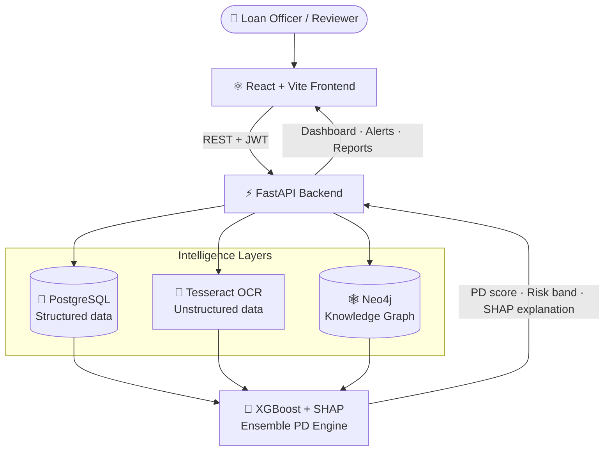

<div align="center">

# 🛡️ DefaultSense AI

### Hybrid Multi-Modal Loan Default Prediction & Decision Intelligence Platform

*Predicting the **Probability of Default (PD)** up to **12 months in advance** — and explaining every decision.*

<br/>


<br/>

**🌐 [Live Demo](https://default-sense-production-5b98.up.railway.app) · 📖 [API Docs (Swagger)](https://default-sense-production.up.railway.app/docs)**

*Built for the **IDBI Bank Hackathon (Hack2Skill)** — Problem Statement 4: Default Prediction Model*

</div>

---

## 🚀 Try It Now — No Sign-up

The live app has a **one-click demo login built for reviewers**:

> **1.** Open **[the live demo](https://default-sense-production-5b98.up.railway.app)**
> **2.** Click **“Explore the demo (for judges)”**
> **3.** You're in — a fully populated risk dashboard, ready to explore.

<sub>Prefer to type it? `demo@defaultsense.ai` / `Demo@1234` (read/write reviewer access, no setup required).</sub>

---

## 📑 Table of Contents

- [The Problem](#-the-problem)
- [Our Approach — Four Intelligence Layers](#-our-approach--four-intelligence-layers)
- [System Architecture](#-system-architecture)
- [Key Features](#-key-features)
- [Model Performance](#-model-performance)
- [Tech Stack](#-tech-stack)
- [Getting Started](#-getting-started)
- [Cloud Deployment](#-cloud-deployment)
- [Project Structure](#-project-structure)
- [Documentation](#-documentation)
- [Build Status](#-build-status)

---

## 🎯 The Problem

Traditional bank default-prediction systems suffer from three critical gaps:

- 📉 **Low accuracy (16–22%)** in flagging genuinely at-risk borrowers
- 🧱 **Structured data only** — they ignore documents, notes, and relationships
- 🧩 **Fragmented methods** that don't generalise across loan types or borrower profiles

**DefaultSense AI** delivers a robust, explainable alternative that flags stressed loans **12 months ahead**, fuses **structured *and* unstructured** signals, adapts to **loan-type and borrower-profile** context, and presents everything through a **single, consistent interpretation framework**.

---

## 🧠 Our Approach — Four Intelligence Layers

Every prediction is the fusion of four independent perspectives on borrower risk:

| Layer | Signal | Powered by |
| :-- | :-- | :-- |
| 🏦 **Structured Intelligence** | Credit history, repayment behaviour, financial ratios | PostgreSQL |
| 📄 **Unstructured Intelligence** | OCR of financial documents, loan-officer notes, sentiment | Tesseract + NLP |
| 🕸️ **Relationship Intelligence** | Employer / industry / guarantor risk propagation | Neo4j Knowledge Graph |
| 🎯 **Decision Intelligence** | 12-month PD + risk band + recommendation + explanation | XGBoost + SHAP |

An **ensemble engine** fuses these layers into one calibrated, **explainable** Probability of Default.

---

## 🏗️ System Architecture



---

## ✨ Key Features

| Screen | What it does |
| :-- | :-- |
| 📊 **Dashboard** | Portfolio-level risk KPIs, distribution charts, and trends |
| 🎯 **Predictions + SHAP** | Run a 12-month PD on any borrower with a per-feature explanation of *why* |
| 🕸️ **Knowledge Graph** | Interactive React Flow map of a borrower's employer, industry, region & connected defaulters, with relationship-risk scoring |
| 📄 **Documents & OCR** | Upload a financial document → live Tesseract text extraction with confidence |
| 🔔 **Alerts** | Auto-flagged high-risk borrowers requiring attention |
| 📑 **Reports** | Exportable portfolio reports (CSV + PDF) |
| 🔐 **Auth & RBAC** | JWT authentication with role-based access (admin / risk manager / loan officer) |

---

## 📈 Model Performance

Trained and validated on a synthetic multi-modal dataset that mirrors real lending signal across all four layers:

| Metric | Score |
| :-- | :-- |
| **ROC-AUC** | **0.915** |
| **Recall** (default class) | **0.886** |
| **Lift over structured-only baseline** | **+0.071 AUC** |
| **Per-segment ROC-AUC** (by loan type) | **0.89 – 0.94** |

> 🧪 **On honest metrics:** default prediction is a heavily *imbalanced* problem, where raw “accuracy” is misleading (a model that predicts “no default” for everyone can look 80%+ accurate while catching nobody). We therefore report **ROC-AUC, Recall, and PR-AUC** — the metrics that actually measure risk-catching ability.

---

## 🧰 Tech Stack

| Layer | Technology |
| :-- | :-- |
| **Frontend** | React 18 + Vite · Tailwind CSS · Zustand · React Router · Axios · Recharts · React Flow |
| **Backend** | FastAPI (Python 3.12) · SQLAlchemy · Pydantic · JWT / OAuth2 |
| **Databases** | PostgreSQL 16 · Neo4j 5 (Knowledge Graph) |
| **AI / ML** | XGBoost · SHAP (Explainable AI) |
| **OCR** | Tesseract OCR |
| **DevOps** | Docker · docker-compose · Railway (cloud) |

---

## ⚡ Getting Started

### Option A — Full stack with Docker *(recommended)*

One command brings up PostgreSQL, Neo4j, the FastAPI backend, and the React frontend. On first boot the backend auto-initialises the databases (schema + seed), creates the demo users, and trains the ML model.

```bash
git clone https://github.com/Ganesh-0509/Default-Sense.git
cd Default-Sense
cp .env.example .env            # optional: customise secrets/credentials
docker compose up -d --build    # first boot takes a few minutes (model training)
```

| Service | URL |
| :-- | :-- |
| Frontend | http://localhost:8080 |
| API + Swagger docs | http://localhost:8000/docs |
| Neo4j browser | http://localhost:7474 |

**Login:** `admin@defaultsense.ai` / `ChangeMe123!` (or the one-click demo button).

### Option B — Local development

```bash
docker compose up -d postgres neo4j                      # databases only

cd backend && python -m venv .venv && source .venv/Scripts/activate
pip install -r requirements.txt
python -m app.scripts.init_all                           # schema + seed + admin + train
uvicorn app.main:app --reload                            # http://localhost:8000/docs

cd ../frontend && npm install && npm run dev             # http://localhost:5173
```

---

## ☁️ Cloud Deployment

DefaultSense runs live on **Railway** (frontend + backend) with **Neo4j AuraDB** and **managed PostgreSQL**. A complete, click-by-click deployment walkthrough — including the config files that pin each service to its Dockerfile — lives in **[`DEPLOY_RAILWAY.md`](./DEPLOY_RAILWAY.md)**.

```
Frontend (nginx)  ──▶  Backend (FastAPI)  ──▶  PostgreSQL (Railway managed)
                                          └──▶  Neo4j AuraDB (free tier)
```

---

## 📂 Project Structure

```
Default-Sense/
├── frontend/     # React + Vite app (pages, components, services, store)
├── backend/      # FastAPI app — layered api → services → repositories → models
├── database/     # PostgreSQL schema + seed, Neo4j constraints + seed
├── datasets/     # Synthetic & sample data
├── models/       # Synthetic-data generation, training, prediction, SHAP artifacts
├── docker/       # Dockerfiles, nginx config, entrypoint
├── docs/         # Full project documentation (01–18)
├── tests/        # Backend, API, AI and integration tests
├── docker-compose.yml
├── DEPLOY_RAILWAY.md
└── README.md
```

---

## 📚 Documentation

Complete design documentation lives in [`docs/`](./docs):

| # | Document | # | Document |
| :-: | :-- | :-: | :-- |
| 01 | Project PRD | 10 | API Specification |
| 02 | System Architecture | 11 | Database ERD |
| 03 | AI/ML Design | 12 | Dataset & Data Sources |
| 04 | Database Design | 13 | Development Roadmap |
| 05 | Backend Architecture | 14 | Project Structure |
| 06 | Frontend UI/UX | 15 | Deployment Guide |
| 07 | Implementation Guide | 16 | UI Wireframes |
| 08 | Hackathon Guide | 18 | AI Training Pipeline |
| 09 | AI Agent Instructions | | |

---

## ✅ Build Status

| Phase | Description | Status |
| :-: | :-- | :-: |
| 0 | Repository scaffold | ✅ |
| 1 | Databases — PostgreSQL + Neo4j schema & seed | ✅ |
| 2 | Backend APIs + JWT authentication | ✅ |
| 3 | Frontend shell (routing, auth, layout) | ✅ |
| 4 | OCR module (Tesseract) | ✅ |
| 5 | Knowledge Graph (Neo4j + risk propagation) | ✅ |
| 6 | AI/ML prediction engine (XGBoost + SHAP) | ✅ |
| 7 | Dashboard & Reports | ✅ |
| 8 | Deployment (Docker + Railway cloud) | ✅ |

**All 8 phases complete — deployed and demo-ready.**

---

## 📄 License

Released under the terms in [LICENSE](./LICENSE).

<div align="center">
<sub>Built for the IDBI Bank Hackathon · Hack2Skill · Problem Statement 4</sub>
</div>
